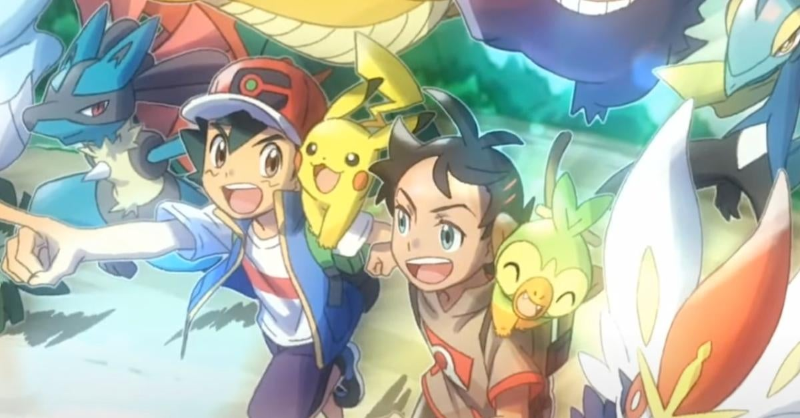

<b>ポケットモンスター (2019)</b> • <b>Pokémon Journeys</b>

---

(This is dozens of hours of golden immersion content, bless this show)

I mean, I've been playing Pokémon since time immemorial, so this was bound to happen.

I did expect this show to get a 10, but I didn't expect it to happen fast, much less the possibility of entering the 11/10 list.

Firstly, this is the first show in the series to have anime-only main characters*: Gō and Koharu. That in and of itself was quite a refreshing thought already, but the way these two characters were handled was just splendid!

(*well, there's Max, but he's May's brother, so uh...)

Gō is a collector, and it's just great to see a personification of the original meaning behind a Pokémon Master: one that catches 'em all.

(Not that I mind the battler persona; just that completing the Pokédex is a more fulfilling activity to me than becoming a Champion)

Then there's Koharu, who exemplifies character development more clearly than anyone I've ever seen before. She carries a sophisticated yet calculated outlook on life, and I respect her a lot for that.

「１•２•３」is incredibly upbeat, and listening to four renditions of the song across over 100 episodes is just a blissful experience. Thanks, まふまふ!

This show's not even over yet. I guess I'll just be here waiting for it to all wash over, waiting for these three to see their ultimate journeys to the end.